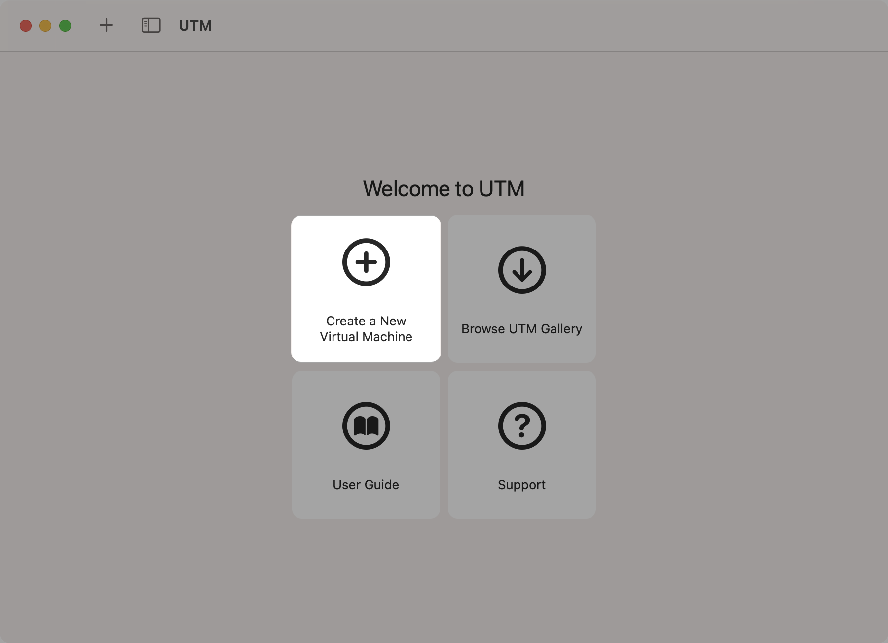
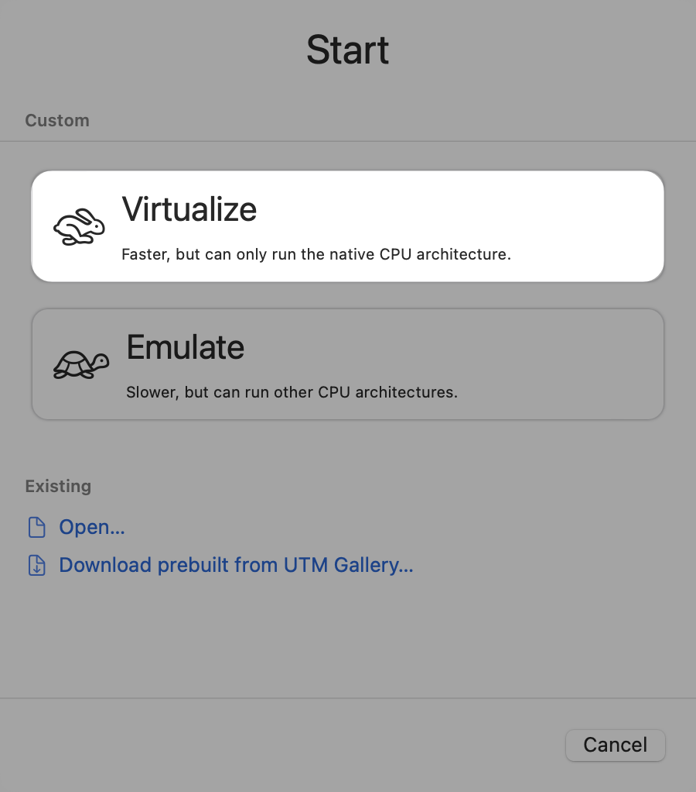
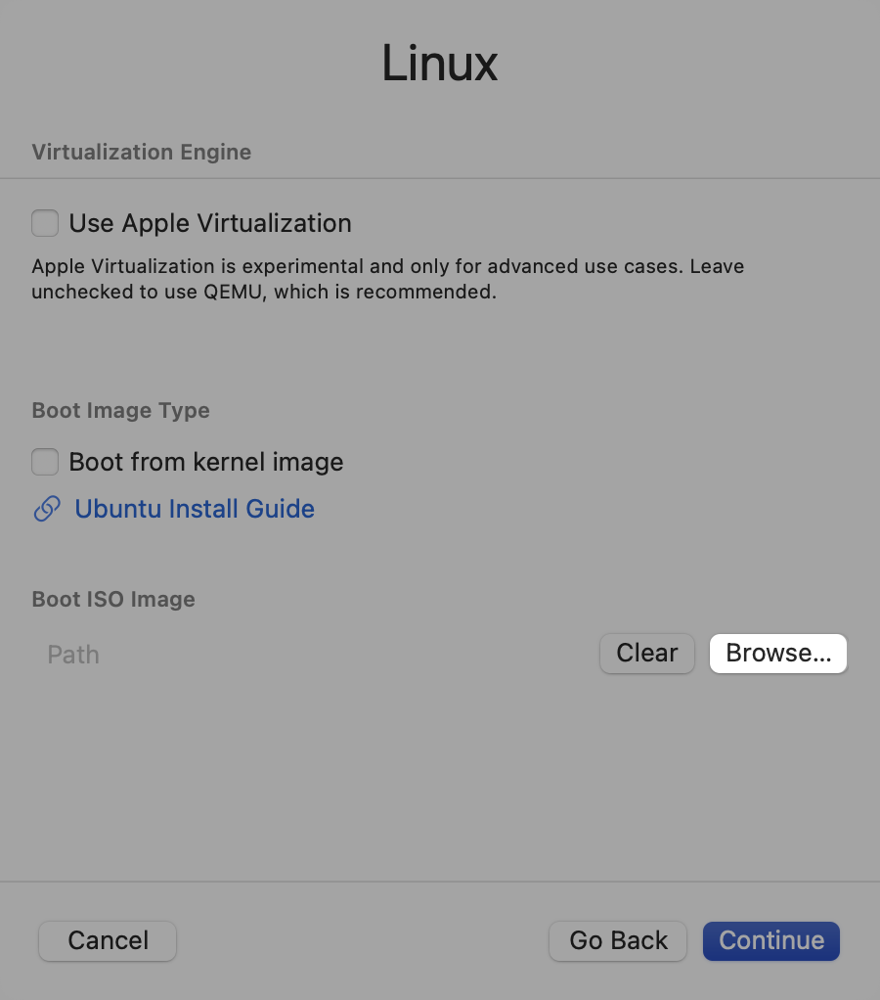

# How to Install Kali Linux on an Apple Silicon Mac Using UTM

## Overview

This guide shows you how to install Kali Linux on an Apple Silicon Mac by using UTM. UTM is a QEMU-based hypervisor and emulator that uses hardware acceleration for better performance.

## Before you begin

Make sure you have the following:

- An Apple Silicon Mac with an M1 or M2 chip
- At least 50 GB of free disk space
- The UTM app
- The ARM64 version of the Kali Linux ISO image

## Installation steps

### Download software

- **UTM app**: Go to the [UTM official site](https://mac.getutm.app/) and download the app.

- **Kali Linux ISO**: Visit the [Kali Linux download page](https://www.kali.org/get-kali/) and download the ARM64 version.

### Configure the virtual machine

3. **Open UTM**: Start the UTM app and select **Create a New Virtual Machine**.

    

4. **Set up the virtual machine**: Choose **Virtualize**, and then select Linux as the operating system.

    

5. **Import the Kali Linux ISO**: Add the ISO image you downloaded earlier.

    

### Install Kali Linux

6. **Configure hardware settings**: Set the memory to 4 GB, the number of CPU cores to 4, and enable OpenGL acceleration.

7. **Allocate disk space**: Provide at least 30 GB of disk space for the virtual machine.

8. **Name the virtual machine**: Enter a name for your virtual machine.

9. **Save your settings**: Choose **Save** to create the virtual machine.

10. **Add a serial device**: Go to the settings for your virtual machine and add a serial device. You'll need this for the installation process.

11. **Start the installation**: Turn on the virtual machine and follow the on-screen prompts to:
    - Choose a system language
    - Set up your timezone and keyboard
    - Create a user account
    - Partition the virtual disk
    - Choose a desktop environment

## After the installation

- Turn off the virtual machine
- Remove the serial device from your virtual machine settings
- Eject the Kali Linux ISO image
- Turn on the virtual machine
- Update your software packages

## Troubleshoot issues

- If the update command fails, run the following command:

```bash
echo "deb http://http.kali.org/kali kali-rolling main non-free contrib" > /etc/apt/sources.list
```

- Instead of upgrading the distribution in the virtual machine, do a clean installation.
- To add more features, install guest additions by running `apt install qb-additions`.
